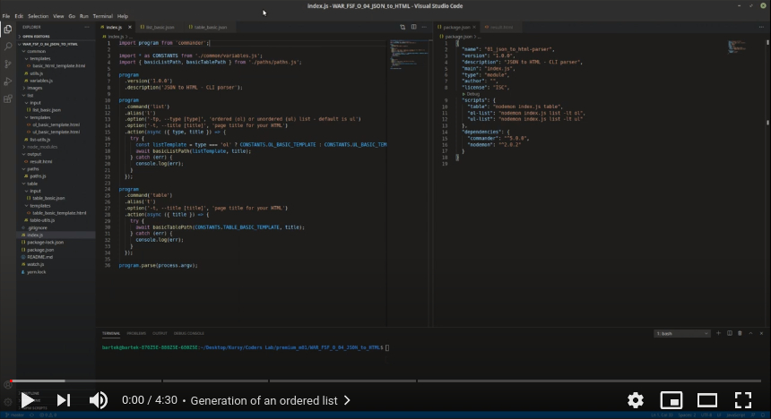
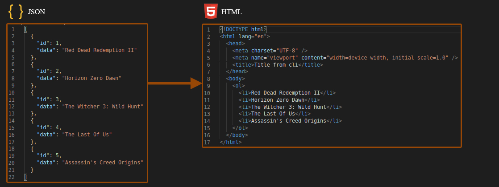
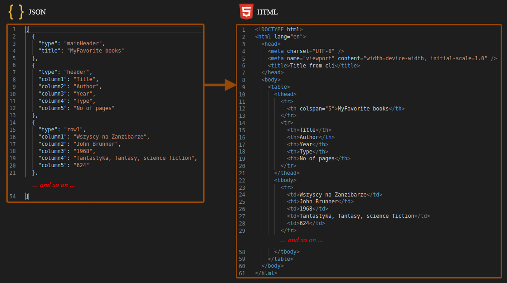

# JSON to HTML - CLI parser (Workshop-1, Node.js)
A command-line interface (CLI) tool generating a simple site basing on a HTML template and JSON-formatted data. The project is the part of the Coders Lab course.

# Video demo
[](https://youtu.be/mV4OnyZnWXg)

# Available forms of data presentation
## List
To generate an ordered list, type:
```
node index.js list --type ol --title "Title from cli"
```



Options (and aliases):

`list` , `l` - list

`--type` , `-tp` - list type, ordered (ol) or unordered (ul) - default is ul

`--title` , `-t` - page title for your HTML

## Table
To generate a table, type:
```
node index.js table --title "Title from cli"
```



Options (and aliases):

`table` , `t` - table

`--title` , `-t` - page title for your HTML

# Information
* The tool is available from command-line interface (see commands shown in the 'Available forms of data presentation' section to use the tool).
* Input JSON files for the list and the table are located in: `./list/input/list_basic.json` and `./table/input/table_basic.json`, respectively.
* Output parsed HTML file is located in: `./output/result.html`
## File watcher
* To start, type:
```
node watch.js
```
* When launched, copies all HTML files you generated into a temporary folder `./temp` to prevent overwriting.
* The temporary folder is removed when the watcher is terminated.

# Technologies
* JS (ES6)
* HTML

# Download and Install
* Use the link from the 'Code' button to download the project.
* In the project directory, type:
```
npm i
```
to install necessary dependencies.
* The tool is ready to use (see commands shown in the 'Available forms of data presentation' section to use the tool).